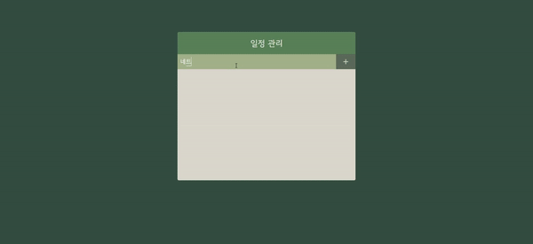

# to-do-list

we made our own react to-do-list  
on `jinju` branch



### installed

- yarn

```
$ npm install --global yarn
```

- Create project

```
$ yarn create react-app to-do-list
```

- libraries

```
$ yarn add sass classnames react-icons
```

[React Icons](https://react-icons.github.io/react-icons/)  
[Google Fonts](https://fonts.google.com/)
